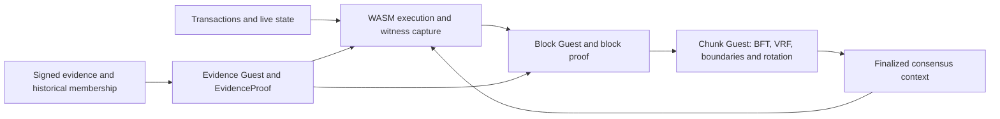

# Neutrino overview

Neutrino is a Rust proof-aware PoS chain. Ordinary execution runs the shared
state-transition function (STF) in WASM/wasmtime. SP1 Compressed STARK proofs
establish block execution, objective evidence validity and chunk consensus.

EvidenceProof establishes an offence. Block execution recursively verifies the evidence statement,
authenticates its historical opening, admits the sanction and executes the
mandatory queue. Chunk aggregation consumes block-proven effects and verifies
consensus; it does not re-execute transactions or evidence facts.

The verifier trusts the chain specification, program identities and initial
consensus context. Checkpoint recursion and a proof-only light client remain
unimplemented. Development upgrades are incompatible: no old proof, transaction
or database migration path is maintained.

Read [architecture](01-architecture.md), [runtime](03-execution-runtime.md),
[proofs](10-proof-system.md), [chunk consensus](19-complete-chunk-proofs.md) and
[accountability](20-evidence-proofs.md). The [roadmap](09-roadmap.md) distinguishes
implemented behavior from outstanding acceptance and protocol work.
