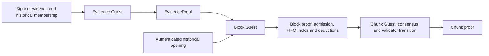

# 20 — Evidence proofs and mandatory sanctions

Status: implemented. Acceptance must be rerun for the current Guest programs
and protocol formats. Real compressed composition is a separate gate from
workspace checks. Checkpoint recursion remains deferred.

## Composition

An independent SP1 evidence guest proves objective offences using historical
membership, signed artifacts and the deterministic proof-rejection verifier.
Its statement binds chain ID and complete chain-spec hash, the historical context, stable offender
identity and the existing evidence-independent penalty ID. The runtime block
guest recursively verifies this proof and authenticates the historical opening
against its incoming consensus anchor. The block STF owns replay protection,
the bounded mandatory FIFO, withdrawal holds and deductions. Chunk proofs
consume the block-proven sanctions and only bind their anchor and consensus
effects; they do not replay evidence verification.

Evidence proofs are reusable across blocks: public statements bind a historical
record, not the current chain tip. A counted Merkle history supplies sparse
openings. The root is authenticated from the previous finalized chunk, never
from the current chunk's future certificate. Program identities are pinned by
the verifier and bound in the composed public statements.

The ordinary-execution host must verify every evidence receipt before WASM
execution. Guest recursion independently checks the same receipts; no supplied
boolean authorizes state changes. Sanction deductions are internal STF operations; the transaction format has no
raw Slash/Leak authorization variants. Inactivity is expressed as an evidence
statement too, without treating certificate non-inclusion as proof of silence.

## Execution and liveness

Only objectively proven, unexpired offences enter the authenticated queue.
Admission fixes the identity, amount and offence ID; pending deductions hold
the offender's withdrawal funds. Every block processes the deterministic FIFO
prefix before ordinary transactions, with a reserved execution budget. Duplicate
submissions cannot duplicate a penalty or block queue progress. Empty-balance
outcomes remain explicit and do not erase the consensus sanction.

The protocol guarantees processing of admitted evidence under chain progress.
It does not claim discovery of hidden signatures or unconditional inclusion of
off-chain reports. Evidence validity windows must fit inside unbonding delays;
admitted pending claims remain enforceable after their admission window ends.
Malformed proofs, verifier panics and resource failures never establish guilt.

## Implementation gates

- [x] Evidence wire statements, sparse historical openings and content identity.
- [x] Independent evidence guest; native parity and SP1 host API.
- [x] Block recursive verification and mandatory runtime queue/withdrawal holds.
- [x] Chunk consumes proven sanctions without evidence verification.
- [x] Node generation, persistent pool, gossip, import and restart paths.
- [x] Adversarial, lifecycle, queue and native/WASM/Guest parity tests.
- [ ] Current-program locked build, complete workspace tests, strict Clippy and
  workspace/Guest format checks.
- [ ] Real SP1 EvidenceProof → block → chunk composition gate: queued for the
  current programs, with process-exit subscription and a local completion notification.

Optional early fact compression and batch aggregation are follow-on
optimizations; individual BFT votes never wait for an SP1 fact proof. The initial
evidence guest directly compresses self-contained signed evidence.

## Statement identity and recursive witnesses

`EvidenceSubmission` commits only the exact public statement and its historical
opening. `Body.evidence_proofs` transports and archives one ordered attachment
per submission, outside the transaction, vote and DA commitments. Missing,
extra, reordered, malformed or mismatched attachments are rejected at execution
and admission boundaries. An attachment carries the evidence program identity;
its cache key is BLAKE3 of the domain-separated program and canonical statement.
Alternative valid proofs for that statement have the same transaction identity.

The ordinary host verifies each actual attachment before WASM execution. The
proving host decodes and verifies it once, then supplies the compressed proof and
pinned verification key through SP1's separate proof stream. The block Guest
checks policy, historical bindings and exact statement public values, invokes
native SP1 recursive verification and only then executes the STF. No proof bytes
enter the STF input, and no full compressed-proof verifier runs in the block Guest.
Production recursion cannot disable deferred verification.

SP1 execution records recursive claims but does not establish that its proof
stream matches them. The compressed circuit binds the accumulated claim digest
to the verified subproofs, including each program and public-values digest.
Host rejection tests cover the attachment boundaries; only real compressed
composition establishes recursive acceptance. SP1's execution report does not
count the recursive assertion syscall, so its counts cannot establish this gate.

`InvalidProofSigning` still binds the exact block proof envelope signed by every
precommit participant. Evidence Guest retains its deterministic exact-byte
rejection verifier for that offence, and `facts_commitment` still commits the
original signed misconduct evidence. Separating the resulting EvidenceProof
witness changes neither guilt nor the mandatory sanctions and withdrawal holds.
The chunk consumes block-proven effects without verifying evidence again.

The host's exact-receipt verifier decodes bounded envelopes once and passes the
proof directly to the SDK's typed verifier. Circuit, successful exit, program
identity, exact public values and trailing-byte rejection remain mandatory.
The block shell retains an immutable validated-input token and executes that
same input without repeating historical binding checks. Chunk proving and
verification share a lazy in-process key; program keys use the circuit/ELF cache.

## Protocol parameters and retention

There is one current unversioned format for chain specs, headers, proofs, storage
and network paths. Existing
nodes or databases must not silently interpret the new wire format.

Defaults are 1,024 blocks for evidence admission, 2,048 blocks for unbonding,
1,024 pending sanctions, and 16 admissions/executions per block. The chain spec
requires `evidence_max_age_blocks + chunk_size < unbonding_delay_blocks` and
nonzero bounded queue throughput. A full FIFO therefore drains within 64
advancing blocks at default throughput. An admitted obligation does not expire.

Historical context commits the chunk, membership and seed, independently of a
certificate's signer subset. Different valid certificates must produce the same
incoming historical root. Inactivity retains the protocol's narrow meaning:
non-inclusion in the submitted valid certificate, not proof that a validator
never voted. The exact submitted certificate is verified inside Evidence Guest
and committed by the claim; its resulting transaction is ordered by consensus.
Every claim binds the complete chain-spec hash and block program identity.

Receipt bytes are capped at 2 MiB. The off-chain cache holds at most 256 receipts
and 32 MiB, never overwrites an existing verified statement, and prunes when its
admission is finalized or its admission window is behind finalized history.
Receipts executed on an unfinalized branch remain available across reorgs. The block builder reserves
mandatory execution gas and bounds attachment plus ordinary transaction bytes.
Background jobs run outside the engine lock; startup/network initialization,
evidence arrival, finalization and production trigger work. Failed raw reports
rotate through bounded batches, preserving capacity for inactivity proofs.

Withdrawals are held by runtime withdrawal account, matching existing shared
collateral semantics. Several BLS identities using one account share its funds;
no design can deduct more collateral than the account contains. Such zero-balance
outcomes are explicit, while the cryptographic identity sanction still applies.

## Acceptance artifacts

`runtime-host/tests/evidence_pipeline.rs` includes native/WASM/Guest rejection,
evidence Guest/native parity, and the ignored real CPU gate
`evidence_block_chunk_real_compressed_recursion`. The real gate starts at an
explicit trusted finalized history fixture, proves the signed offence, recursively verifies that statement and proves
its actual deduction from 100 stake, then proves and verifies the containing
consensus chunk and validator sanction. It must run with real compressed proofs;
mock SP1 receipts are never accepted by the production evidence verifier.

Run the workspace checks in `AGENTS.md` and the separate real gate with
`scripts/check-evidence-proof.sh`. Native execution and mock recursion do not
establish real compressed composition acceptance. Acceptance of a previous ELF
cannot be carried over to changed programs.

The gate atomically saves each verified evidence, block and chunk proof under
`target/proof-acceptance/evidence-pipeline`, configurable with
`NEUTRINO_EVIDENCE_GATE_DIR`. Checkpoint identities bind the circuit version,
stage ELF, exact inputs and expected statement. Block witness inputs include the exact
evidence attachment; chunk inputs include the exact block proof and attestations.
Restart reuses a matching stage only after cryptographic verification against its
current expected statement. Invalid or corrupt checkpoints fail the gate;
unfinished writes cannot publish a successful stage. Changed programs or inputs
use separate artifacts, so a completed predecessor never authorizes a changed ELF.

Long CPU gates can run from frozen test executables and subscribe to the preceding
process's exit with kqueue. A local macOS notification reports completion; this
mechanism does not send an automatic chat message or poll the prover. Keep the
executable hash and final verdict with that run's artifacts.
